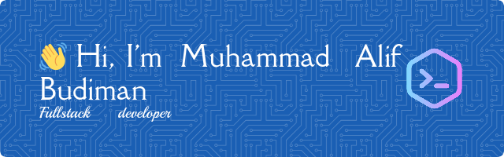

  

  

🎓 Fresh Graduate in Computer Science from Universitas Negeri Jakarta  
💻 Full-Stack Web Developer passionate about building impactful web applications  
🌍 Based in Bekasi, Indonesia  
🌐 [muhammadalifbudiman.my.id](https://muhammadalifbudiman.my.id)

## 🧠 About Me

I'm a web developer who loves transforming ideas into real-world applications.  
With experience in both front-end and back-end development, I build scalable and maintainable solutions using modern technologies.

## 💻 Tech Stack

                   

## 🚀 Featured Projects

- **[Klinik Google](#)** — Full-stack web app for managing healthcare services  
- **[Task Master](#)** — Real-time task management app with scheduling and history  
- **[Numble](#)** — Backend developer for smart number learning app  

> Browse all my repositories to see more! 📂

## 🌐 Let's Connect

    

# 📊 GitHub Stats:
 
 

## 🏆 GitHub Trophies

### 🔝 Top Contributed Repo

## 💰 You can help me by Donating
   

